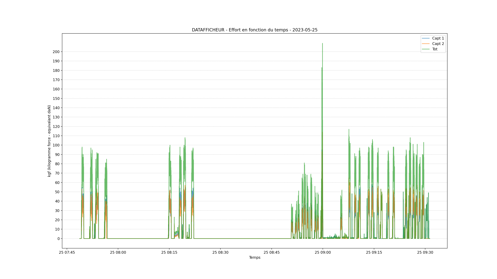

# Datafficheur

Ce programme permet la lecture des données du capteur Datafficheur (http://hippotese.free.fr/blog/index.php/?q=datafficheur).

Il permet :
* l'assemblage des fichiers bruts et la production d'un fichier globale (avec une ligne par dixième de seconde)
* la génération d'un graphique (eg. format PDF, PNG, SVG)



Les trames pour 1 capteur
```csv
565,06/10/2022,15:52:11,53,55,69,70,55,56,52,57,63,64 (1 capteur) à
```
sont converties
```csv
06-10-2022,15:52:11.1,53,53
06-10-2022,15:52:11.2,55,55
```

Les trames pour 2 capteurs
```csv
565,06/10/2022,15:52:11,53,55,69,70,55,56,52,57,63,64,52,56,50,50,52,56,61,48,49,39 (2 
```
sont converties
```csv
06-10-2022,15:52:11.1,53,52,105
06-10-2022,15:52:11.2,55,56,111
```

### Usage


```shell
python3 datafficheur.py --help
usage: Datafficheur [-h] -d DIR [-n NOTE] [-v VERBOSE] [-o OUTPUT] [-p | --plot | --no-plot] [-op OUTPUTPLOT]
                    [-z TIMEZONE]

Lecture des données du capteur Datafficheur. http://hippotese.free.fr/blog/index.php/?q=datafficheur

optional arguments:
  -h, --help            show this help message and exit
  -d DIR, --dir DIR     Chemin vers le dossier contenant les données Datafficheur.
  -n NOTE, --note NOTE  Fichier indiquant les temps de début et fin et le type d'outil. Par défaut: note.csv
  -v VERBOSE, --verbose VERBOSE
                        Affiche des messages sur la progression.
  -o OUTPUT, --output OUTPUT
                        Nom du fichier créé. Par défaut: output.csv
  -p, --plot, --no-plot
                        Création d'un graphique. (default: True)
  -op OUTPUTPLOT, --outputplot OUTPUTPLOT
                        Sauvegarde du graphique (eg. format PDF, PNG, SVG). Par défaut: None
  -z TIMEZONE, --timezone TIMEZONE
                        Fuseau horaire. Par défaut: Europe/Paris

```


Exemple : Traitement des données du répertoire `mesures-brutes-apres-midi` avec une sortie graphique au format PNG.

```shell
python3 datafficheur.py -d mesures-brutes-apres-midi/ -op output.png
```


Un fichier `note.csv` peut indiquer le type d'outil ou l'opération réalisée :
```csv
2022-10-06 15:44,2022-10-06 15:48,"Brabanette âge métal, 9ème trou"
2022-10-06 15:48,2022-10-06 15:53,"Idem 10ème trou"
2022-10-06 15:53,2022-10-06 15:56:39,"Idem 12ème trou"
2022-10-06 15:57:36,2022-10-06 16:00,"Idem 10ème trou, Labour bordure enherbée."
```
Ces informations sont ajoutées dans le fichier de sortie.


### Auteurs

* BPasquiet - 16/06/2022
* Deny Fady
* François Prunayre