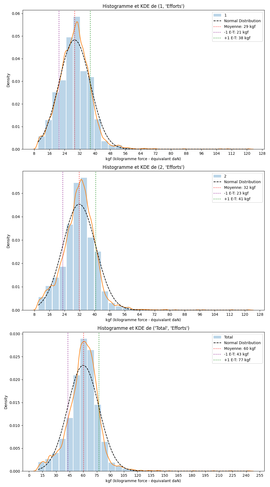
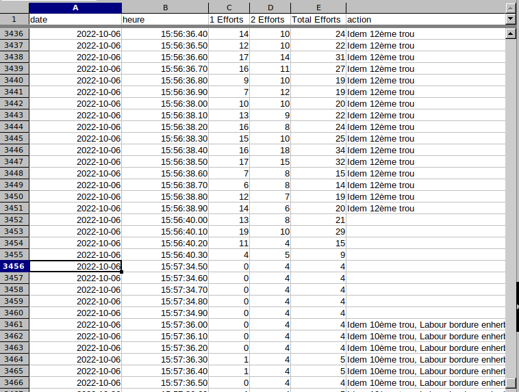

# Datafficheur

Ce programme est conçu pour la lecture et la manipulation des données en provenance du capteur Datafficheur, disponible sur [hippotese.free.fr/blog](http://hippotese.free.fr/blog/index.php/?q=datafficheur).




## Table des matières
1. [Fonctionnalités](#fonctionnalités)
2. [Utilisation](#utilisation)
3. [Exemple d'application](#exemple-dapplication)
4. [Auteurs](#auteurs)

## Fonctionnalités

Le programme Datafficheur offre plusieurs fonctionnalités majeures, notamment :
* Assemblage des fichiers bruts pour produire un fichier global, avec une ligne par dixième de seconde.
* Génération de graphiques *(courbe d'effort, distribution d'effort)* aux formats divers, tels que PDF, PNG, SVG.
  
#### Transformation des trames

Les trames pour un capteur :
```csv
565,06/10/2022,15:52:11,53,55,69,70,55,56,52,57,63,64 (1 capteur)
```
sont transformées en :
```csv
06-10-2022,15:52:11.1,53,53
06-10-2022,15:52:11.2,55,55
```

De même, les trames pour deux capteurs :
```csv
565,06/10/2022,15:52:11,53,55,69,70,55,56,52,57,63,64,52,56,50,50,52,56,61,48,49,39 (2 capteurs)
```
sont transformées en :
```csv
06-10-2022,15:52:11.1,53,52,105
06-10-2022,15:52:11.2,55,56,111
```

## Utilisation

Pour utiliser le programme Datafficheur, exécutez la commande suivante :
```shell
python3 datafficheur.py --help
```

### Options disponibles

- `-h, --help`: Affiche le message d'aide.
- `-n NOTE, --note NOTE`: Spécifie le fichier indiquant les temps de début et de fin ainsi que le type d'outil (par défaut: `note.csv`).
- `-v VERBOSE, --verbose VERBOSE`: Active les messages de progression.
- `-o OUTPUT, --output OUTPUT`: Nomme le fichier de sortie (par défaut: `output.csv`).
- `-p, --plot, --no-plot`: Active ou désactive la création d'un graphique.
- `-op OUTPUTPLOT, --outputplot OUTPUTPLOT`: Définit le nom et le format de sortie du graphique (ex : PDF, PNG, SVG).
- `-pht PLOTHTICKS, --plothticks PLOTHTICKS`: Spécifie la segmentation de l'axe Y (par défaut: 10).
- `-z TIMEZONE, --timezone TIMEZONE`: Définit le fuseau horaire (par défaut: Europe/Paris).
  
**Argument requis** :
- `-d DIR, --dir DIR`: Chemin vers le dossier contenant les données Datafficheur.

## Exemple d'application

Pour traiter les données du répertoire `mesures-brutes-apres-midi` avec une sortie graphique au format PNG, exécutez :
```shell
python3 datafficheur.py -d mesures-brutes-apres-midi/ -op output.png
```

L'utilisation d'un fichier `note.csv` permet d'indiquer le type d'outil ou l'opération effectuée, ces informations seront ajoutées au fichier de sortie :
```csv
2022-10-06 15:44,2022-10-06 15:48,"Brabanette âge métal, 9ème trou"
2022-10-06 15:48,2022-10-06 15:53,"Idem 10ème trou"
...
```



## Auteurs

- **Benoît Pasquiet** - Institut Français du Cheval et de l'Equitation
- **Deny Fady**
- **François Prunayre**
